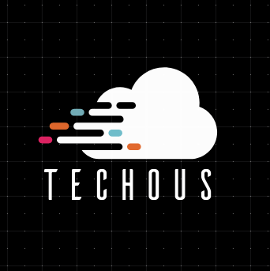

# TechOus-logo

This is the logo of our Open Source Community TechOus. It a weird logo but we are improving it and making it better. Please follow the below process for design.

## Process of design

* logo should be presentable
* logo should follow a proper commit and change format
* logo should be feasable.

## OFFICIAL LOGO

### LIGHT

### NIGHT

## OTHER LOGO VARIANTS

### BLACK

### BLUE

### PURPLE RED

### LIGHT BLUE

### SPARKLE BLACK

## LOGO FORMAT AVAILABLE

* Html format

## CONTRIBUTION

If you are interested in making the logo better than you see [these details](CONTRIBUTING.md).

## LICENSE

Our project is under [MIT LICENSE](LICENSE).

## AUTHORS

1. nidhimittal2
2. anarchymonkey
3. GauravWalia19
